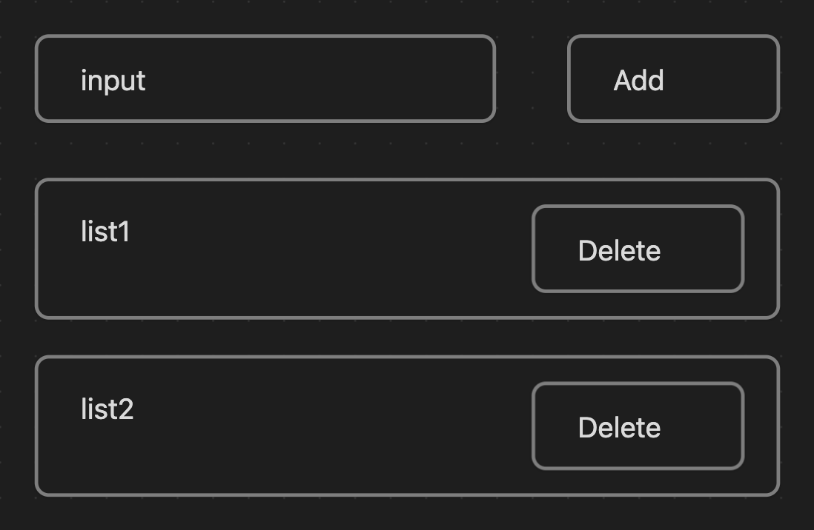

# [wanted-pre-onboarding-frontend-challenge-19](https://github.com/summerdidi/wanted-pre-onboarding-frontend-challenge-19)

## 목록

- 안내사항
- 과제 공통 세팅
- 과제 1
- 과제 2

## 안내사항

과제 세팅에 맞춰 과제를 수행해주세요. 세팅값에 맞지 않는 프로젝트는 과제 확인이 불가능합니다. 과제 제출 전에 확인하고 제출 부탁드립니다.

- [x] 과제 제출 최상단에 개인 이력서 주소 첨부해주세요.
- [x] create-react-app 혹은 vite🙆‍♀️으로 프로젝트를 생성합니다.
- [x] 아래 과제 공통 세팅의 폴더 구조를 확인합니다.
- [x] 과제를 제출하는 방법은 본인이 작업한 github repository 주소를 [issues](https://github.com/summerdidi/wanted-pre-onboarding-frontend-challenge-19/issues)에 올리면 됩니다.
- [x] 과제물은 main 브랜치에 올립니다.
- [x] 프로젝트는 node version 20에서 실행할 수 있어야합니다.🙆‍♀️ -> 현재: v20.11.0
- [x] Settings -> Codespaces -> Configuration Select branch를 main 으로 하고 제출합니다.(codespace 확인용도)
- [x] 함수형 컴포넌트를 사용해 코드를 짜주세요.

## 과제 공통 세팅

- cra로 과제를 수행하기 위해서는 node.js와 npm이 설치 되어있어야 합니다.
- 폴더 구조는 가능한 아래 양식을 맞춰주세요.
- 스타일은 tailwind, styled-component🙆‍♀️, scss등 자유롭게 설정하시면 됩니다.
- 아래 폴더와 파일은 필수 요소입니다. 나머지는 자유롭게 설정해주세요.

```
/src
  /components
    /List
  /store
  App.tsx
  index.tsx
```

## 과제 1 todo list 만들기

Add와 Delete 기능 2 가지를 만듭니다.

1. input 창에 list1을 입력 후 Add 버튼을 누르면 input 창 하단에 list1 컴포넌트가 뜹니다.
2. 각 list의 delete 버튼을 누르면 해당 list 컴포넌트가 삭제됩니다.



- 디자인은 자유롭게 해도 됩니다. 위의 2가지 버튼과 그에 따른 기능이 있으면 됩니다.
- 가능하면 컴포넌트를 만듭니다. (작은 단위라도 좋습니다.)
- 전역상태를 관리해주세요.(가능한 Redux나 Redux-toolkit🙆‍♀️을 이용해주세요.)

## 😎 과제 1 결과물

- 사용 기술: Vite, React, TS, RTK, styled-components, yarn

[🎯 사이트 바로가기](https://hi-rachel.github.io/wanted-pre-onboarding-19/)

## 과제 2

질문을 읽고 답해주세요. 본인이 알고 있는 만큼 답변해주시면 됩니다.

1. DOM과 Virtual DOM을 설명해주세요.
2. 리액트의 특징을 설명해주세요.
3. flux 패턴에 대하여 설명해주세요.
4. 상태관리에 대하여 설명해주세요.
5. 궁금한 것에 대하여 알려주세요.

## ✏️ 과제 2 답변

1. DOM과 Virtual DOM을 설명해주세요. <br>

   ### DOM

   DOM(Document Object Model)은 메모리에 웹 페이지 문서 구조를 트리 구조로 표현해서 웹브라우저가 HTML 페이지를 인식하게 해준다.

   DOM Tree 안에는 각각의 Element에 상응하는 Node가 들어있다. 개발자들은 이 DOM이 제공하는 API를 통해 DOM 구조에 접근하고, 원하대로 Element를 조작할 수 있다.

   Virtual DOM은 실제 DOM과 같은 내용을 담고 있는 복사본이다. 복사본은 실제 DOM이 아닌 JS 객체 형태로 메모리 안에 저장되어 있다. 실제 DOM에 복사본이기 때문에, 실제 DOM의 모든 Element와 속성을 공유한다. 차이점은 브라우저에 있는 문서에 직접적으로 접근할 수 없다.

   ### Virtual DOM이 필요한 이유\_리액트가 활용하는 방식

   리액트는 항상 2개의 가상돔 객체를 가지고 있다.

   1. 렌더링 이전 화면 구조를 나타내는 가상돔
   2. 렌더링 이후에 보이게 될 화면 구조를 나타내는 가상돔

   리액트는 STATE가 변경될 때마다 Re-Rendering이 발생하게 되는데, 이 시점마다 새로운 내용이 담긴 가상돔을 생성한다. (실제 브라우저가 그려지기 이전)

   렌더링 이전에 화면의 내용을 담고 있는 첫 번째 가상돔과 업데이트 이후에 발생할 두 번째 가상돔을 비교해 정확히 어떤 Element가 변했는지를 비교한다(Diffing - 효율적인 알고리즘을 사용, 매우 신속하게 파악 가능).

   리액트는 이를 통해 차이가 발생한 부분만을 실제 DOM에 적용한다. (Reconciliation\_재조정) 변경된 모든 Element들을 집단화시켜 이를 한 번에 실제 DOM에 적용하는 방식을 사용해 매우 효율적이다(Batch Update).

2. 리액트의 특징을 설명해주세요.

   - 컴포넌트 기반 아키텍처를 기반으로 한 높은 재사용성, 유지보수성
   - 자바스크립와 XML을 조합한 JSX 문법 -> 선언적 방식: 가독성을 높이고, 직관적 이해 가능
   - 뛰어난 유연성과 호환성
   - Virtual DOM으로 빠른 렌더링 속도 제공
   - 단방향 데이터 흐름, 즉 부모 -> 자식으로만 데이터가 전달이 가능

3. flux 패턴에 대하여 설명해주세요.

   **flux의 기본적인 형태**

   **Action -> Dispatcher -> Store -> View**

   데이터가 한 방향으로만 흐른다.

   - 어떤 Action이 발생하면, Dispatcher에서 이를 받아와 해석한 후 Store에서 저장된 정보에 변경을 가하고, 그 결과가 다시 View로 전달되도록 한다.

     (모바일에서 터치하는 것처럼 웹에서도 사용자가 View를 통해서 클릭 같은 액션을 발생시킬 수 있다. View -> Action -> Dispatcher)

   - Action: Action Creator, 클릭 같은 이벤트가 발생했을시, 그 이벤트가 발생했음을 **Action 정보를 담고 있는 객체**를 만들어내 Dispatcher에 전달하는 역할을 한다.
   - Dispatcher: 중앙 허브 역할, 들어오는 Action 객체 정보를 받아 실제로 어떤 행동을 할지 결정하는 곳. 주로 switch문으로 들어오는 Action 객체를 나누어 처리한다. 미리 정해둔 Action 객체의 type을 구분해 미리 작성해둔 명령들을 수행한다.
   - Store: 데이터, 상태를 담고 있다. React에서는 이 Store를 Dispatcher와 연결해 Store에 접근할 수 있도록 callback 명령을 제공할 수 있다.
   - View: Store에서 어떤 이벤트(변경 등)가 발생하면 View는 변경된 점을 가져오고, 이를 바탕으로 화면을 다시 렌더링한다.

   - (flux 패턴 예시)

   ```javascript
   const initialState = {
     number: 0,
   };

   function reducer(state, action) {
     switch (action.type) {
       case 'ADD':
         return {
           number: state.number + 1,
         };
       default:
         return state;
     }
   }
   ```

   reducer 함수는 React의 useReducer에 넣어서 Dispatcher에 제공해줄 메서드. 이 함수는 상태와 Dispatcher가 받은 Action에 따라 어떤 명령을 수행할지 그 내용을 callback으로 제공한다고 볼 수 있다.
   ADD라는 타입의 Action 객체를 받으면, 현재 number에서 1을 추가해 새로운 객체를 상태로 넘겨준다. 다른 타입의 객체라면, 그냥 현재 상태를 그대로 돌려준다.

   ```javascript
   function Counter() {
     const [state, dispatch] = useReducer(reducer, initialState);

     const onAdd = () => {
       dispatch({ type: 'ADD' });
     };

     return (
       <div>
         <h1>{state.number}</h1>
         <button onClick={onAdd}>Add</button>
       </div>
     );
   }
   ```

   React에서 제공하는 useReducer를 이용해, 위에서 만들었던 reducer와 initialState로 state, dispatch를 얻는다. 여기서 state는 View가 상태에 접근할 수 있도록 하고, dispatch는 Dispatcher의 역할을 한다.

   Redux도 flux pattern을 이용. flux의 문제는 reducer가 상당히 커질 수 있기 때문에 프로젝트 크기가 크지 않고, 상태 값이 많지 않다면 Context API, useReducer 등의 기본 리액트 기능을 활용하는 방법도 있다. 하지만 프로젝트가 점점 커지고 복잡성이 높다면 Redux를 사용해서 상태관리 하는 것이 훨씬 용이하다.

4. 상태관리에 대하여 설명해주세요.

   ### 상태관리의 필요성

   React는 여러 컴포넌트로 구성되어 있고, 단방향 흐름으로 부모 -> 자식으로만 데이터가 전달이 가능해 자식 컴포넌트도 상태에 맞게 변경하려면 props로 전달해야 한다.

   **문제점**

   1. 컴포넌트간 부모 - 자식 관계가 아니라면 상태를 전달하기 어렵다.
   2. props drilling 깊이가 깊어지고 컴포넌트가 복잡해지면 추적이 어렵고 가독성이 떨어진다.

   이 문제를 해결하기 위해 보통 여러 전역 상태 관리 라이브러리를 사용한다.

   **전역 상태 관리**

   여러 컴포넌트에서 공유해야 할 상태를 한 곳에서 중앙 집중적으로 관리하는 것을 의미. <br>

   > 전역 상태 관리로 관리하는 상태 예시<br>
   > 로그인한 사용자의 정보, 설정 값(테마, 언어 등), 캐시된 데이터, 알림 및 메세지, 쇼핑 카트 목록 등

   사용 이유

   - 데이터 일관성: 중앙 집중식으로 데이터 불일치 문제를 방지할 수 있다.
   - 코드 재사용성: 상태 관리 로직을 한 곳에서 관리하므로, 필요한 로직을 재사용하기 쉽다.
   - 유지 보수: 상태가 어떻게 변경되고 전파되는지 명확해 디버깅이나 추가 기능 구현이 간단해진다.

5. 궁금한 것에 대하여 알려주세요.

   Q. 전역상태관리 툴로 주로 zustand를 사용하는데 RTK로 바꿔서 사용할 필요가 있는 경우도 있을까요?

### 참고 문서

[Virtual DOM](https://callmedevmomo.medium.com/virtual-dom-react-%ED%95%B5%EC%8B%AC%EC%A0%95%EB%A6%AC-bfbfcecc4fbb)

[flux 패턴](https://medium.com/hcleedev/web-react-flux-%ED%8C%A8%ED%84%B4-88d6caa13b5b)

[전역 상태 관리](https://velog.io/@river-m/%EB%A6%AC%EC%95%A1%ED%8A%B8-%EC%A0%84%EC%97%AD-%EC%83%81%ED%83%9C-%EA%B4%80%EB%A6%AC#:~:text=14%2F21-,%EC%A0%84%EC%97%AD%20%EC%83%81%ED%83%9C%20%EA%B4%80%EB%A6%AC%EB%9E%80%20%EB%AC%B4%EC%97%87%EC%9D%B8%EA%B0%80%3F,%EC%A0%84%EC%97%AD%20%EC%83%81%ED%83%9C%EC%97%90%20%ED%95%B4%EB%8B%B9%ED%95%9C%EB%8B%A4.)
